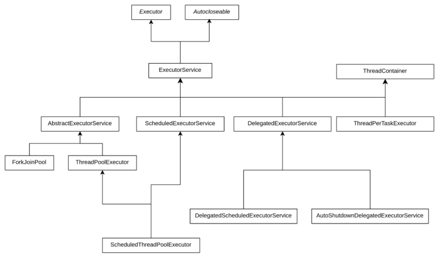
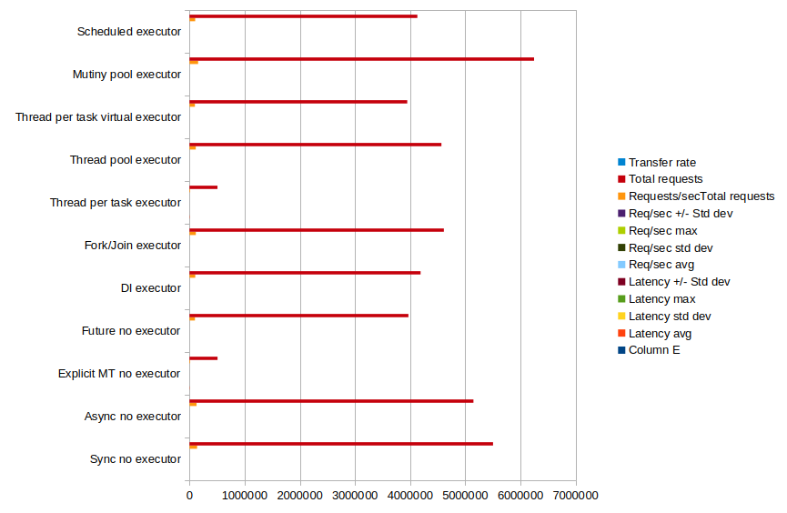
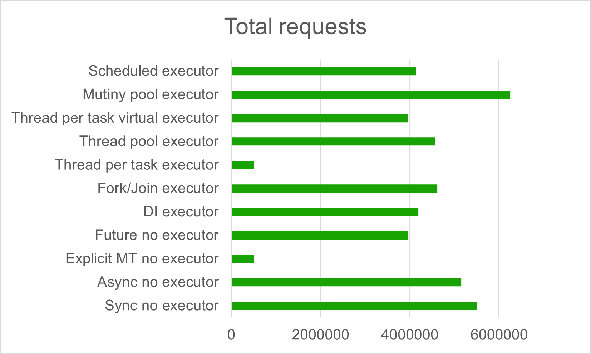

\pagebreak
\tableofcontents
\pagebreak

# Introduction

Concurrent programming is one of the challenges of the most vital importance in
many areas of computer science. This concept designates the ability that programming
languages offer to design programs as independent execution units working together in
a specific composition.

Notice that concurrent programming doesn't mandatory mean
"parallel programming". Whether these independent execution units run in parallel, or
in overlapping period of times, isn't essential in order to define concurrent
programming.

Multi-threading is a fundamental capability in Java that enables concurrent execution
of multiple tasks within a single program, leading to improved application performance
and better resource utilization. While Java provides built-in support for creating
threads by extending the `Thread` class or implementing the `Runnable` interface,
manually managing threads can be resource-intensive and potentially lead to scalability
issues. This is where the *Executor Framework* comes in, offering a more sophisticated
and efficient approach to thread management by providing thread pooling and reuse
capabilities. 

Executors abstract away the complexities of thread creation and lifecycle 
management, allowing developers to focus on business logic while the framework
handles the underlying threading infrastructure. The *Executor Framework* is particularly
valuable in modern applications that need to handle multiple concurrent operations,
such as web servers processing multiple requests, background tasks, or applications
performing parallel computations.

This report aims at analysing the most recent and modern Java multi-threading
mechanisms and techniques, through the use of different categories of executors.
Illustrated with real-world business cases, the report compares all these implementations
in a small benchmark which, if it doesn't pretend to be an absolute reference, 
gives at least a precise idea concerning how and when each one of the presented
solution to be used.

# A short history of Java concurrent programming

From its very first releases, back in '90s, Java has provisioned support for 
concurrent programming on the behalf of the `java.lang.Thread` class and its 
associated `java.lang.Runnable` interface. At that time, when very few programming
languages provided multi-threading support, and probably none in a native mode,
Java developers were able to benefit of quite advanced constructs to create and
manage threads.

Later, around the end of the 90s, Java 1.2 highly improved the thread management
by introducing the notions of `ThreadGroup` and thread priorities. Other major 
enhancements were brought by Java 1.4, in the beginning of the Y2K, with the 
introduction of the NIO (*New I/O*) package providing thread ability to perform
non-blocking I/O operations and improving dramatically, this way, their performances.

But the real revolution in thread management came with Java 5, in 2004, with the
introduction of the `java.util.concurrent` package, which brought a plethora of
new features and, among others, the *executors framework*. From now on, developers
didn't need any more to manually handle complex thread management details but, 
taking advantage of this new frameworks, they can delegate them to special designated 
components, named *executors*. These components remove the developers' responsibility
of the explicit thread management, in the code, by allowing them to benefit of 
worker threads pools, able to execute tasks asynchronously.

This evolution has continued, in particular with Java 6, in 2006, which added 
new kinds of executors, and with Java 7, in 2011, when another new framework for
thread management, known as the *fork/join framework*, has been introduced.

One of the major enhancements brought by Java 8, in 2014, was the *streams API*
and, with it, the `CompletableFuture` and `ComppletionStage` classes, allowing
a more flexible and powerful approach to asynchronous programming. With the 
introduction of the `java.util.concurrent.Flow` API, Java 9 creates, in 2017, 
the foundation of the reactive programming, bringing asynchronous stream processing
with backpressure to the developer's toolset, allowing for more responsive and 
resilient applications.

Fast-forward to 2024, from Java 10 to Java 23, the enhancement process of the concurrent 
programming usability and performance has continued. To culminate with the 
integration of the project Loom, bringing massive concurrency through virtual 
threads to Java. Initially proposed as a preview in Java 19, virtual threads 
became reality with Java 21 and were more present than ever in Java 23 LTS, the
last as per this writing.

So much so that currently, in order to implement multi-threading processing, the
Java developers have the choice between doing it explicitly, in the code, or taking
advantage of one among the half-dozen of executors proposed today to them. What 
alternative to choose ? Which one is the best ?

Well, while this article doesn't pretend to give a definite answer to such a general
question, it aims at shading some more light to this topic, which might be perceived
as a bit obscure by developers.

# Comparing Java executors: what's the point ?

Comparing Java executors among each other or comparing them with the more direct
and explicit `Thread` instantiation, aims at analysing these two crucial multi-threading
concepts, exploring their differences, use cases, and providing practical code 
examples. We'll be doing that using two angles: performances and code reliability
and maintainability.

While very important in the enterprise grade services landscape, performances
aren't the most important criterion to use in order to score applications. And 
as we'll see soon, using the most advanced and recent multi-threading techniques,
don't mandatory bring performance enhancements, on the opposite. 

In order to illustrate our textbook here, we'll use one of the most common business
case example: the one of a REST service exposing a simple endpoint on HTTP. And
as you'll see in a moment, this simple endpoint could be implemented using either 
synchronous or asynchronous processing, blocking or non-blocking one. As a matter
of fact, it's appropriate to make a distinction between synchronous/asynchronous
and blocking/non-blocking processing.

A REST service is a network piece of software and, as such, it requires that all
the participants to be operational for the complete duration of the exchanges.
But this isn't the case in real-world where nodes that we want to interact
with might not be available or, even worst, while reachable, these nodes fail to
process the requests, whatever the reason could be.

So, what is it more important in this case, running fast or being able to reliably
and gracefully handle communication uncertainties, like retries, fail-overs, etc. ? 
All that to say that, if by using Java executors to manage multi-threading, you happen
to notice a drop of performances, then your conclusion shouldn't be to not use 
them. But rather to understand that Java executors represent a valuable abstraction 
over the concurrent programming, bringing you a more consistent and reliable 
software architecture.

# The business case

As already mentioned, the business case used to illustrate our discussion is a 
simple REST service which exposes the following two endpoints:

      @GET
      public <Result> getCurrentDateAndTimeAtDefaultZone();
      @GET
      @Path("{zoneId}")
      public <Result> getCurrentDateAndTimeAtZone(@PathParam("zoneId") String zoneId)

Here the `<Result>` notation is a placeholder for the processing result which,
depending on the service implementation, be it synchronous or asynchronous, might
be different, for example `String`, `void`, etc.

The first endpoint, as its name implies, returns the current date and time at the
default zone. The 2nd one returns the same date and time but at the time zone which 
ID is passed as the endpoint's input path parameter.

Our objective here is to implement and test this service using different Java 
multi-threading techniques and to test these implementations such that to be 
able to compare them each-other and to get a consistent benchmark report.

# The implementations

We choose [Quarkus](https://quarkus.io/), the famous supersonic, subatomic Java stack to illustrate our
use cases. Hence, our sample REST service will be further implemented using several
techniques, as follows:

  - The synchronous implementation. This is probably the most classic implementation where the REST service doesn't use multi-threading but simply synchronously returns the processing result.
  - The asynchronous implementation. This version takes advantage of the Jakarta RESTfull specs, as supported by Quarkus, in order implement the same use case, but in an asynchronous manner.
  - The simple non-blocking implementation. This time our service will explicitly spawn a new thread to handle the request.
  - The DI (*Dependecny Injection*) executor implementation. In this example, the service will submit the task execution to an executor injected through Jakarta CDI (*Context and Dependency Injection*).
  - The *thread-pool-executor* implementation. In this example, the service will submit the task execution to a thread pool executor.
  - The *thread-per-task* executor implementation. In this example, the service will submit the task execution to a thread per task executor.
  - The virtual thread executor implementation. In this example, the service will submit the task execution to a virtual thread per task executor.
  - The scheduled executor implementation. In this example, the service will submit the task execution repeatedly and with an interval and delay, via a scheduled executor.
  - The reactive implementation. In this example, the service becomes reactive by using Mutiny, the Quarkus even-driven reactive library.

Let's take now these implementations, one by one, and discuss them in details. The code may be found [here](https://github.com/nicolasduminil/executors.git). 

# The synchronous implementation

This is the most common implementation of a REST service. You'll find it in the
module `none-sync` in our GitHub project. Here below is a code fragment:

    @Path("time")
    @Produces(MediaType.TEXT_PLAIN)
    public class TimeResource
    {
      private static final String FMT = "d MMM uuuu, HH:mm:ss XXX z";
      private static final Logger LOG = LoggerFactory.getLogger(TimeResource.class);

      @GET
      public String getCurrentDateAndTimeAtDefaultZone(@QueryParam("delay") @DefaultValue("0") int delay)
      {
        Thread.sleep(delay * 1000L);
        LOG.info("*** TimeResource.getCurrentDateAndTimeAtDefaultZone() ***");
        return ZonedDateTime.now().format(DateTimeFormatter.ofPattern(FMT)
          .withZone(ZoneId.systemDefault()));
      }

      @GET
      @Path("{zoneId}")
      public String getCurrentDateAndTimeAtZone(@PathParam("zoneId") String zoneId)
      {
        Thread.sleep(delay * 1000L);
        String decodedZoneId = URLDecoder.decode(zoneId, StandardCharsets.UTF_8);
        return ZonedDateTime.now(ZoneId.of(decodedZoneId)).format(DateTimeFormatter
          .ofPattern(FMT).withZone(ZoneId.of(decodedZoneId)));
      }
    }

As you can see, it's very simple, there is not much to explain here. The two 
endpoints produce text mime type. They are both serving GET requests and they 
both take an input parameter of type query, as an integer with the default value
zero. It is used to delay the service response such that to simulate, if required,
a longer running operation. As a matter of fact, the multi-threading advantages
aren't obvious for fast services and, in order to demonstrate them, we might 
need a longer processing time.

The first endpoint doesn't take any other parameter while the 2nd one has an 
additional resource, annotated by `@Path` and takes as an input path parameter
the time zone ID. They return both a `String` instance formatted as a date and
time with time zone. This time zone is the default one, in the case of the first
endpoint, and the one passed as parameter, in the case of the 2nd one. A message
is logged by the first endpoint and it aims at checking the current thread name.

Unit tests are provided with each implementation. They are using the [RESTassured](https://rest-assured.io/)
DSL (*Domain Specific Language*) like API and, given that they are all the same, 
whatever the service implementation is, it's a good design decision to apply the
template pattern and to use an abstract class in order to factor their common 
behaviour. The listing below shows the abstract class that all the RESTassured 
tests are extending.

    public abstract class BaseTimeResourceTest
    {
      protected static final String FMT = "d MMM uuuu, HH:mm:ss XXX z";
      protected URI timeSrvUri;

      @BeforeAll
      public void beforeAll() throws URISyntaxException
      {
        timeSrvUri = getTimeSrvURL().toURI();
        assertThat(timeSrvUri).isNotNull();
      }

      @AfterAll
      public void afterAll()
      {
        timeSrvUri = null;
      }

      @Test
      public void testCurrentTime()
      {
        Response response = given().when().get(timeSrvUri);
        assertThat(response.statusCode()).isEqualTo(HttpStatus.SC_OK);
        assertThat(response.getBody()).isNotNull();
        assertThat(LocalDateTime.parse(response.prettyPrint(), DateTimeFormatter.ofPattern(FMT)))
          .isCloseTo(LocalDateTime.now(), byLessThan(1, ChronoUnit.HOURS));
      }

      @Test
      public void testCurrentTimeWithZoneId()
      {
        Response response = given().baseUri(timeSrvUri.toString())
          .pathParam("zoneId", URLEncoder.encode("Europe/Kaliningrad", StandardCharsets.UTF_8))
          .when().get("{zoneId}");
        assertThat(response.statusCode()).isEqualTo(HttpStatus.SC_OK);
        assertThat(response.getBody()).isNotNull();
        assertThat(LocalDateTime.parse(response.prettyPrint(), DateTimeFormatter.ofPattern(FMT)))
         .isCloseTo(LocalDateTime.now(), byLessThan(1, ChronoUnit.HOURS));
      }

      protected abstract URL getTimeSrvURL();
    }

The code above is the common one for all the unit tests as, should the REST 
services be synchronous or asynchronous, blocking or not-blocking, should they 
use any kind of executors or not at all, they respond the same way when invoked.

The unit tests are basically all the same, except their URL. Hence, the class 
`BaseTimeResourceTest` provide the abstract method `getTimeSrvURL()` that each 
subclass has to implement such that to return the current URL. For example:

    @QuarkusTest
    public class TestTimeResource extends BaseTimeResourceTest
    {
      @TestHTTPEndpoint(TimeResource.class)
      @TestHTTPResource
      URL timeSrvUrl;

      @Override
      protected URL getTimeSrvURL()
      {
        return timeSrvUrl;
      }
    }

This unit test, that is located in the `none-sync` module of our GitHub repository,
uses the Quarkus specific annotation `@QuarkusTest` to flag the class 
`TestTimeResource` as a Quarkus unit test. With this annotation, the Quarkus 
JUnit 5 extension will start an embedded [Undertow](https://undertow.io/) web server and deploy to it 
the *fat JAR* resulted from the Maven build process execution.

Please notice also the fluency and the expressivity of the [AssertJ](https://assertj.github.io/doc/)
library that we're using instead of the standard JUnit 5 assertions. For example, 
statements like the following:

    ...
    assertThat (...isCloseTo(LocalDateTime.now(), byLessThan(1, ChronoUnit.HOURS))...);
    ...

check whether a date and time is close by less than one hour to the current one.

Once deployed, the Quarkus application will listen for REST requests on the default
URL http://localhost:8081. But this URL is configurable and, in order to avoid 
hard-coding it, the other two Quarkus specific annotations `@TestHTTPEndpoint` 
and `@TestHTTPResource` are used to capture it. For example, should we have 
chosen to configure our project to run as a Kubernetes service on `http://<host>:<port>`,
the values of the `timeSrvUrl` property would have been `http://<host>:<port>/time`.
This is because the class `TimeResource`, which is our REST service, is 
annotated with `@Path("time")`.

Now in order to run the unit tests, proceed as follows:

    $ cd executors
    $ mvn -DskipTests clean install
    $ cd none-sync
    $ mvn test

Notice that, since our project is a multi-module one, a `mvn install` command
has to be executed, such that some modules, used here as shared artifacts, be 
deployed in the local Maven repository. And in order to avoid running all the 
unit tests, which could be time-consuming, the option `-DskipTests` is used.
Not doing that and trying to run `mvn test` before having done an `install` 
might raise unfounded dependencies exceptions.

Okay, so this was the most classical implementation of our sample REST service.
Let's look now at other different alternatives.

# The simplest asynchronous implementation

The simplest possible asynchronous implementation of the same REST service can be
found in the module `none-async` of the GitHub project. Here below is a code 
fragment:

    @GET
    public void getCurrentDateAndTimeAtDefaultZone(@QueryParam("delay") @DefaultValue("0") int delay, 
      @Suspended AsyncResponse ar)
    {
      Thread.sleep(delay * 1000L);
      ar.resume(ZonedDateTime.now().format(DateTimeFormatter.ofPattern(FMT)
        .withZone(ZoneId.systemDefault())));
      ...
    }

What you probably will observe right away is the fact that both endpoints return `void`
this time. The other point to notice is that they both accept a parameter of class 
`AsyncResponse`, annotated with `@Suspended`. Doing that, turns this operation in
an asynchronous one as the associated HTTP request, `GET` in this case, becomes 
suspended from the current thread of execution. It sends the response back to the
consumer by calling `AsyncResponse.resume()` and passing in the result. This way,
a status code of 200, together with the current date and time in the default time
zone, is sent back.

In order to test this implementation of our REST service, proceed in a similar
way as you already did previously:

    $ cd executors/none-async
    $ mvn test

You should see a successful test report.

Now that we discussed the `@Suspended` annotation and the class `AsyncResource`,
both standard Jakarta REST and supported by Quarkus, let's come to the bad news:
this so-called asynchronous example isn't truly asynchronous ! The `Thread.sleep()`
statement, used here to possibly simulate a heavier process, is a blocking operation,
of course. But even if the `delay` parameter is 0, which is its default value and, hence, there is
consequently no sleep, there is no actual asynchronous processing as the code 
immediately calls `ar.resume()` in the same HTTP request thread, which is blocked
while executing the operation. Accordingly, this example is fully equivalent with
the one in the module `none-sync`, despite its name and despite using `@Suspended AsyncResponse`.
You'll notice that later, 
when we'll do our benchmark to compare the different service's implementations,
that these two examples will provide practically the same metrics.

# A true asynchronous implementation

Let's see now a "more true" asynchronous implementation in the module `none-explicit`
of our GitHub repository.

    @GET
    public void getCurrentDateAndTimeAtDefaultZone(@QueryParam("delay") @DefaultValue("0") int delay,
      @Suspended AsyncResponse ar)
    {
      LOG.info(MSG);
      new Thread(() ->
      {
        try
        {
          Thread.sleep(delay * 1000L);
        }
        catch (InterruptedException e)
        {
          throw new RuntimeException(e);
        }
        ar.resume(ZonedDateTime.now().format(DateTimeFormatter.ofPattern(FMT)
         .withZone(ZoneId.systemDefault())));
        LOG.info(MSG);
      }).start();
    }
Now, our endpoint spawns a new thread to handle the task. This background thread
might sleep for a while, if you use the query parameter `delay`, such that to 
simulate a long-running operation, and then sends the response back to the client,
exactly the way that this happened before.

When you previously ran the implementation in the `none-async` module, you've 
seen log messages like:

    ... [fr.sim.wor.exe.asy.non.TimeResource] (executor-thread-1) ...

where `executor-thread-1` is the name of the HTTP request thread. Now, testing 
the new implementation, you'll see that:

    ... [fr.sim.wor.exe.asy.exp.TimeResource] (executor-thread-1) ..
    ... [fr.sim.wor.exe.asy.exp.TimeResource] (Thread-45) 
           *** TimeResource.getCurrentDateAndTimeAtDefaultZone() ***

> **_NOTE:_** Here we're using the SLF4J library to log messages. Since these 
> messages are logged with the *debug* severity, you might need to set up your
> SLF4J configuration such that these messages be displayed.

You can see the `executor-thread-1` as before, being the HTTP request thread, 
and `Thread-45` which is now the new worker thread spawned to execute the task.
This time the `ar.rseume()` statement is executed by the worker thread. In this
case, the main thread doesn't wait anymore for the task to complete. It is free
to possibly handle other tasks while the background thread processes the request.
Let's break down what happens in this code:

  - The HTTP request thread receives the request
  - A new worker thread is created and started
  - The HTTP request thread immediately returns (non-blocking)
  - The new thread executes the formatting and response logic independently
  - The new thread calls ar.resume() to send the response

Okay, so we managed to have a "true" asynchronous and non-blocking implementation
of our REST service. However, as you probably see it coming, there is a catch: 
while the code above is truly asynchronous and non-blocking, it isn't aligned 
with the best practices because:

  - Creating new threads manually (`new Thread()`) for each request is expensive and doesn't scale well - you could run out of system resources under heavy load
  - There's no thread management or pooling, which means you have no control over how many threads are created

The next implementation provides a better way to implement asynchronicity.

# A better asynchronous implementation

Look at the code in the `none-future` module. It aims at providing a "true" 
asynchronous implementation of our REST service, aligned to the best practices.

    @GET
    public void getCurrentDateAndTimeAtDefaultZone(@QueryParam("delay") @DefaultValue("0") int delay,
     @Suspended AsyncResponse ar)
    {
      LOG.info(MSG);
      CompletableFuture.supplyAsync(() ->
      {
        try
        {
          Thread.sleep(delay * 1000L);
          return ZonedDateTime.now().format(DateTimeFormatter.ofPattern(FMT)
            .withZone(ZoneId.systemDefault()));
        }
        catch (Exception e)
        {
          ar.resume(e);
          return null;
        }
      })
      .thenAccept(result ->
      {
        ar.resume(result);
        LOG.info(MSG);
      })
      .exceptionally(throwable ->
      {
        ar.resume(throwable);
        return null;
      });
    }

What's new in this implementation is that, as you can notice, this time we're 
using Java 8 `CompletableFuture` class. Java provides the interface `java.util.concurrent.Future`
since its 5th release, i.e. since 2004. At that time this class was the only 
solution to implement asynchronous processing. But it has some severs limitations
like, for example, the lack to combine or chain actions.

With Java 8, since 2014, and the introduction of several new classes and 
interfaces, like `CompletableFurure`, in the `java.util.concurrent` package, the
Java developers are able to implement asynchronous code performing operations in
a monadic style and without blocking the main thread. This approach is based on the
same idea that we've already seen, consisting in spawning new threads and offloading
work on them, but this time, instead of manually creating threads, we take advantage
of thread pools and higher concurrency abstractions.

In the code above, using `CompletableFuture.supplyAsync()` asynchronously executes
the given `Supplier` on a different thread allocated from the *fork-join* pool.
Compared with the previous implementation where thread were handled explicitly, 
in the code, this approach allows for better thread management, provides a more 
proper error handling and follows the best practices of concurrent programming 
in Java.

Testing again, we'll see the following log messages:

    ... [fr.sim.wor.exe.asy.fut.TimeResource] (executor-thread-1) ...
    ... [fr.sim.wor.exe.asy.fut.TimeResource] (ForkJoinPool.commonPool-worker-1) ...

The first one is logged by the main thread, named `executor-thread-1` while the
2nd one by the new created worker thread, named `ForkJoinPool.commonPool-worker-1`.
Here the thread name prefix shows that it has been allocated from the *fork-join*
pool, as explained.

Okay, we should be glad about our new enhanced implementation that uses the most 
recent features of the `java.util.concurrent` package. But we can do even better:
we can use executors that will help us to get more control over the thread pool 
and over the thread instantiation and creation process.

# Using Java *executors*

In modern Java applications, the thread management process isn't implemented by
casually spawning them, as we have done in our last two examples, but by using 
*executors*.

An *executor* is a Java object which implements the interface `java.util.concurrent.ExecutorService`.
There are currently 4 main implementations of this interface:

  - `ThreadPoolExecutor`
  - `ForkJoinPool`
  - `ThreadPerTaskExecutor`
  - `ScheduledThreadPoolExecutor`

The utility class `java.util.concurrentExecutors` provides the following additional
executors:

  - `DelegatedExecutorService`
  - `DelegatedScheduledExecutorService`
  - `AutoShutdownDelegatedExecutorService`

As you can see, there are a lot of executors, each one with its own particularities
and, in the following sections of this brochure, we'll look at them, one by one,
trying to clarify when and how to use each one.

The figure below represents a class diagram of the executor services provided 
by Java 21 LTS.

## The default executor service

Sometimes, there are situations when any executor service, described above and that
Java 21 provides, is fine and you don't care much of which one using. This is the
perfect case for the default executor service.

The module `di` in our GitHub repository uses the default executor service to 
process requests:

    @Path("time-async-di")
    public class TimeResource extends BaseTimeResource
    {
      @Inject
      private ExecutorService executor;

      @Override
      protected ExecutorService getExecutor()
      {
        return executor;
      }
    }

As opposed to our previous REST service implementations the ones using an executor
service are all very similar. Accordingly, the abstract class `BaseTimeResource`
capture their common behaviour:

    @Produces(MediaType.TEXT_PLAIN)
    public abstract class BaseTimeResource
    {
      private static final String FMT = "d MMM uuuu, HH:mm:ss XXX z";
      private ExecutorService executor;
      private static final Logger LOG = LoggerFactory.getLogger(BaseTimeResource.class);
      private static final String MSG = "BaseTimeResource.getCurrentDateAndTimeAsync() *** Executor: {}";

      @PostConstruct
      public void postConstruct()
      {
        executor = getExecutor();
      }

      @GET
      public void getCurrentDateAndTimeAsync(@QueryParam("delay") @DefaultValue("0") int delay, @Suspended AsyncResponse asyncResponse)
      {
        LOG.info(MSG);
        executor.submit(() ->
        {
          LOG.info(MSG, executor.getClass().getName());
          try
          {
            Thread.sleep(delay * 1000L);
            asyncResponse.resume(getCurrentDateAndTimeAtDefaultZone());
          }
          catch (Exception e)
          {
            executor.shutdown();
            asyncResponse.resume(e);
          }
        });
      }
      ...
      protected abstract ExecutorService getExecutor();
    }

The code in the listing above shows how one of our REST service's endpoint is now
implemented, on the behalf of an executor service. While this executor service
might be of different types, the processing template or strategy is the same. 
And in order to be able to take advantage of a specific type of executor services,
the abstract method `getExecuotor()` is provided. It is implemented by each subclass
such that to initialize the current concrete executor.

An executor service is able to offload work to a thread on the behalf of its 
`submit()` method which takes an instance of `Callable` or `Runnable` as its 
input argument, and returns a `Future`. In our implementation, we submit the 
request processing to a thread allocated by the executor service. How this thread
is allocated and handled, depends on the type of the executor service which is 
abstracted here. The `Callable` or `Runnable` instance taken by the `submit()` 
method as its input parameter is here a `java.util.function.Supplier` instance
implemented as a Lambda function. While using Lambda functions for this purpose
is very practical, this isn't mandatory, of course, and any other way to 
instantiate a `Runnable` or a `Callable` is supported.  

The worker thread started by the executor begins by sleeping for a while, if we
want to simulate a longer run and use the `delay` query parameter of `GET` request.
Then it gets the default zone date and time which is formats as required, before
asynchronously returning to the consumer. In cas of exception, please notice how 
the worker thread is stopped, by shutting down the executor. This feature is very
important as, in Java, there is no way currently to stop a thread by using either
`Thread` or `Runnable`.

The service implementation uses the default executor service by injecting it. 
And since the injected `ExecutorService` is an interface, we don't have access
here to its concrete implementation. This is because we don't care which implementation
of `ExecutorService` will be used as anyone will do.

However, testing the service as we did before with all the other implementations,
we'll se the following message in the log:

    ... [fr.sim.wor.exe.bas.BaseTimeResource] (executor-thread-1) ...
    ... [fr.sim.wor.exe.bas.BaseTimeResource] (executor-thread-2) ... Executor: ... ScheduledExecutorService...

The first line is displayed by the main thread, named `executor-thread-1`. The 
2nd one is displayed by the worker thread, started by the executor service, named
`executor-thread-2`. And the implementation class of the executor service is 
`ScheduledExecutorService`, a specific Quarkus proxy for the standard `ScheduledThreadPoolExecutor`.
We'll be looking soon, in more details, at this kind
of executor service but, for now, we can wonder why is this class injected as 
the `ExecutorService` implementation and not another one, more basic ?

The answer is simple: Quarkus provides it as its default executor service. 
This makes sense because 
`ScheduledExecutorService` is a more feature-rich implementation of `ExecutorService`
adding provision for scheduled task execution, as we'll se later. While we don't
need here any additional complexity, the use of `ScheduledExecutorService` as the
default implementation doesn't have any downside for the current usage. Other
platforms may provide another default implementation.

## The thread-pool executor

The most essential particularity of the *thread-pool* executor is the fact that
it creates a thread pool that reuses a fixed number of threads, operating on a
shared unbounded queue. It takes as its input parameter an integer representing
the maximum number of threads in the pool that should be actively processing 
tasks at any moment.

If additional tasks are submitted and all threads are active, they will wait in
the queue until a thread is available. If any thread terminates, due to an executor
failure, a new one will take its place. The threads in the pool will exist until
executor is explicitly shutdown.

The implementation in the `thread-pool-executor` module shows how to use this 
executor:

    @Path("time-async-direct")
    public class TimeResource extends BaseTimeResource
    {
      @Override
      protected ExecutorService getExecutor()
      {
        return Executors.newFixedThreadPool(2);
      }
    }

That's all given that the main code is factored in the class `BaseTimeResource`
that we have already discussed. Here we create a thread pool in which maximum 
two of them will be allowed to process requests concurrently. This means that 
our service will be able to serve maximum two request concurrently, the other 
possibly ones should wait for one of the threads finishes its current processing.

If processing only one concurrent request at a time is an option, then using:

    Executors.newFixedThreadPool(1);

is equivalent to:

    Executors.newSingleThreadExecutor();

## The thread-per-task executor

If the tasks you're executing are longer-running and you don't need to maintain
a pool of available threads, then the *thread-per-task* is the solution you're
looking for. The difference between these two multi-threading models is subtle.
While the *thread-pool* strategy creates a fixed number of threads in a pool which
will stay alive even after the executed tasks terminate, when they will 
return to the pool and remain available to execute the next task in the queue, 
the *thread-per-task* strategy will create one thread for each task and, when 
the task is done, the associated thread is terminated and disposed.

The module `threadper-task` in our GitHub project illustrates that:

    @Path("time-async-tpt")
    public class TimeResource extends BaseTimeResource
    {
      @Override
      protected ExecutorService getExecutor()
      {
        return Executors.newThreadPerTaskExecutor(Executors.defaultThreadFactory());
      }
    }

The `newThreadPerTaskExecutor(...)` method of the class `Executors` takes an input
parameter of the class `java.util.concurrent.ThreadFactory`. A thread factory, as
the name implies, is an object that creates new threads on demand. It allows to
customize the created threads by configuring their names, the thread groups, their
priorities, etc.

The code in the listing above uses the default thread factory, which creates all
new threads in the same thread group. The new created threads will belong to the
same thread group as the current security manager thread, if any, or the one of 
the thread invoking the `defaultThreadFactory` statement otherwise. 

Each new thread is created as a non-daemon thread, with priority set to the 
minimum of `NORM_PRIORITY` and the maximum priority permitted in the thread group.
The naming convention used is of the form  *pool-N-thread-M*, where N is the
sequence number of the thread factory and M is the sequence number of the thread 
created by this factory.

Testing the REST service will allow you to verify that the details mentioned 
above are satisfied by inspecting the log file where you'll see:

    ... [fr.sim.wor.exe.bas.BaseTimeResource] (executor-thread-1) ...
    ... [fr.sim.wor.exe.bas.BaseTimeResource] (pool-8-thread-1) ...

The first line is displayed by the main thread named `executor-thread-1`, as usual,
while the 2nd line is displayed by the new created working thread, which name satisfies
the defined naming convention.

In order to better illustrate the difference between the *thread-pool* executor
and the *thread-per-task* one, the `ExecutorResource` class, in the `thread-per-task`
module of our project, defines a `Runnable` and starts it on several threads 
created with both kind of executors. Testing this REST service will show that,
while the *thread-pool* executor keeps active and uses always the same threads 
to run new tasks, the *thread-per-task* one will create new threads each time 
new tasks are assigned. Look at the thread names in the log and you'll notice 
this behaviour.

Another thing to notice is the fact that, in this last example, we instantiate 
the *thread-per-task* executor as follows:

    private final ExecutorService perTaskExecutor =
      Executors.newThreadPerTaskExecutor(Thread.ofPlatform().factory());

This contrasts with our previous example where this same operation was done like
this:

    Executors.newThreadPerTaskExecutor(Executors.defaultThreadFactory());

Both approaches are valid but `Thread.ofPlatform().factory()` is generally more 
suitable in modern Java applications (Java 21+) for several reasons:

  - It's part of the modern virtual thread API, which provides better clarity about the thread type being created (platform threads in this case).
  - It's more explicit in its intent as it clearly indicates you want platform threads as opposed to virtual threads, as we'll see soon in another example.
  - The `Thread.ofPlatform().factory()` approach is more flexible as it allows you to chain additional configurations if needed. For example, should we wanted to customize the thread naming convention and to use "daemon" threads, we could have written:

        Thread.ofPlatform()
          .name("custom-prefix-", 0)  // Custom naming pattern
          .daemon(true)               // Set as daemon threads
          .factory();

> **_NOTE:_** Daemon threads are background threads that run intermittently in the background,
and have lower priority.

## The virtual-thread-per-task executor

The JEP 425 adds to Java 19, as a preview, and to Java 21 LTS, as a final implementation,
the concept of *virtual threads*. 

Unlike regular threads, also called *platform threads*, which are OS threads, 
virtual threads are lightweight and, hence, suitable for massive multi-threading.
According to this multi-threading model, a single platform thread, called the 
*carrier* thread, can run many virtual threads, potentially millions.

A full introduction to virtual threads is definitely outside the scope of this 
report but, if we wanted to resume the most important benefit brought to Java
multi-threading by this feature, then this benefit would be the ability to execute
blocking code in an unblocking way. The principle is that, when the carrier thread
executes a blocking operation, for example an I/O call, a dedicated scheduler runs 
a virtual thread and offloads the operation on it, such that the carrier thread 
isn't blocked. In other words, developers can write synchronous code without having
to bother with complex asynchronisms like continuations, callbacks and other monads.

To give an idea of how easy this process is, have a look at the `TimeResourceVT` 
class in the `thread-per-task-virtual` project. As you can see, this class is the
identical copy of the `TimeResource` one in the `none-sync` project, which implements
the simplest possible endpoint, using synchronous processing. By annotating it with
`@RunOnVirtualThread` annotation, this synchronous class magically becomes 
asynchronous and uses virtual threads.

Now, testing the REST service and looking in the log, you'll be
surprised to notice that, this time, you'll see the following lines in the log:

    ...[fr.sim.wor.exe.bas.BaseTimeResource] (executor-thread-1) ...
    ...[fr.sim.wor.exe.bas.BaseTimeResource] () ...

The name of the carrier thread is the same as always, but the 2nd line, written
by a virtual thread, shows that its name is empty. This isn't
a bug but the expected behaviour. By default, virtual threads don't have a name,
while platform threads do. This is by design in the Java implementation.

The reason platform threads have names by default while virtual threads don't is
related to their different use cases:

- Platform threads are more heavyweight and typically fewer in number, so having names is useful for debugging
- Virtual threads are designed to be lightweight and can exist in very large numbers (potentially millions), so they skip this overhead by default

In our case, in order to track the virtual threads handling, we could modify the
code such that to display the thread ID instead of thread name.

Lets' come back now to the virtual thread executor. We have seen that one of the
advantages of using the *thread-per-task* multi-threading model is 
its ability to be switched to virtual threads, in order to align with 
high throughput scenarios. The class `TimeResource` in the `thread-per-task-virtual`
module of our project shows how easy is to switch to virtual threads:

    @Path("time-async-tptv")
    public class TimeResource extends BaseTimeResource
    {
      @Override
      protected ExecutorService getExecutor()
      {
        return Executors.newThreadPerTaskExecutor(Thread.ofVirtual().factory());
      }
    }

As you can see, by simply replacing, `Thread.ofPlatform().factory()` by 
`Thread.ofVirtual().factory()` we are ready for the massive multi-threading 
processing. By simply replacing `Thread.ofPlatform().factory()` in our previous
example by `Thread.ofVirtual.factory()` we switched from using platform threads 
to virtual threads and step this way in the massive multi-threading world.

## The ForkJoin executor

You've seen above how to manage multi-threading on the behalf of *thread-pool* 
and *thread-per-task* executors, where tasks are pushed to threads. The `ForkJoin`
executor proposes a different model. Threads are still allocated in pools and 
stay alive waiting for work, tasks are still stored in queues associated to 
pools. But unlike the precedent pools, where threads can only execute tasks in 
their associated queues, this different model allows threads in the pool to steal
tasks from other queues, as soon as they become idle.

This model is known as the *work stealing algorithm* and is particularly efficient
to implement recursive processing or for tasks spawning other subtasks. It leads
to better load balancing and better CPU utilization as it reduces the likelihood 
of having idle threads, while tasks are waiting in queues to be processed.

The module `fork-join` in our GitHub project shows an example of this type of 
executor. 

    @Path("time-steal")
    public class TimeResource extends BaseTimeResource
    {
      @Override
      protected ExecutorService getExecutor()
      {
        return Executors.newWorkStealingPool(2);
      }
    }

Here, we're instantiating a *fork-join* executor with two threads in the pool.
Tasks will be pushed to these threads from the working item queue associated to
the pool or, when there aren't such tasks, from queues associated to other pools,
if any.

Testing the REST service, you'll notice the following lines in the log:

    ... [fr.sim.wor.exe.bas.BaseTimeResource] (executor-thread-1) ...
    ... [fr.sim.wor.exe.bas.BaseTimeResource] (ForkJoinPool-1-worker-1) ...

As you can see, the first line is written by the main thread, named as usual 
`executor-thread-1` while the 2nd one is written by one of the thread in the 
*fork-join* pool, named `ForkJoinPool-1-worker-1`.

Another more specific example is provided by the class `ExecutorsResource` in the
same project. This class compares two executors, a *thread-pool* one and a *fork-
join* one. Two tasks types are defined as well: a long one taking 3 seconds and
quick one taking 0.5 second.

Running this test you'll observe:

  - For the *thread-pool*:
    - Tasks are processed in the order they're submitted
    - If one thread gets the long tasks, it will be busy while other threads might be idle
    - Total execution time tends to be longer due to less efficient work distribution
  - For the *fork-join* pool:
    - Better load balancing as idle threads can steal work
    - More efficient distribution of the workload
    - Generally faster total execution time for uneven workloads
      
  Even if the total execution time between the two scenarios might be minimal,
  the *work-stealing* pool should complete faster because it can better distribute
  the uneven workload. The thread names in the log will show how tasks are 
  distributed differently between the two approaches. The *thread-pool*
  might show more tasks being processed by the same thread, while the 
  *work-stealing* pool shows better distribution.

  This example particularly highlights the advantage of *work-stealing* when dealing
  with tasks of varying durations, which is a common real-world scenario. 

## The scheduled executor

A scheduled executor is one which implements the interface `ScheduledExecutorService`.
We've already used a scheduled executor a previous project, when we injected 
in our REST endpoint the default executor service. As a matter of fact, with 
Quarkus, the default executor service is a `ScheduledExecutorService`.

In this new module, named `scheduled`, we'll demonstrate some specific features
of this executor category.

There are three use cases that the `ScheduledExecutorService` aims at:

  - running a task once with a delay;
  - running a task periodically;
  - running a task with a fixed delay between executions.

The task we're talking about here is an instance of `Callable` or `Runnable`.
The class `TimeResource` in the `scheduled` project illustrates all these cases, 
as follows:

  - the endpoint `/delayed` executes the associated task once, with a delay in seconds equal to the value of the query parameter having the same name. This parameter is optional and its default value is 5.
  - the endpoint `/periodic` sleeps during an `initialDelay` after which it executes this same task periodically, every `period` seconds. Here `period` is an optional query parameter having the default value of 5. In our case the task is executed 5 times before the service returns.
  - the endpoint `/fixedDelay` sleeps during `initDelay` seconds, after which it executes this same tas periodically but, instead of providind a period (a cycle), we provide a duration to be waited at the end of each execution. Here this duration is provided in the form of the optional query parameter `delay` which has a default value of 5.

The execution is tracked by messages displayed in the log, via which you can 
follow the execution and check that everything work as expected. 

## Combining executors with reactive programming

The [ReactiveX](http://reactivex.io) website defines the reactive programming as follows:

> **_NOTE:_** Reactive programming combines functional programming, the observer
> pattern and the iterable pattern.

While this definition captures some core elements of the reactive programming, 
like the observer and the iterator patterns, I found it somewhat incomplete. A 
more consistent one is provided by Amazon Q:

> **_NOTE:_** Reactive programming is a programming paradigm focused on asynchronous
> data streams and their transformations over time, combining both push and pull 
> models through the observer and iterator patterns, while incorporating functional
> programming principles. It includes built-in mechanisms for handling backpressure
> and provides tools for building responsive, resilient, and elastic systems.

As opposed to other JVM based programming languages like Scala and Clojure, Java
wasn't initially a native *reactive* programming language. But this changed since
Java 9 which introduced, in 2017, the [Flow](https://shorturl.at/PlKNg) API. But
using this API explicitly has been proved complicated in the wake of its
complexity, verbosity and low level. 

Several libraries, like [RxJava](https://github.com/ReactiveX/RxJava), [Reactor](https://projectreactor.io/), 
or [Mutiny](https://smallrye.io/smallrye-mutiny), have emerged throughout the years
aiming at facilitating the use of the `Flow` API, by providing lots of 
ready-to-used operators for transforming, combining and manipulating streams, 
as well as sophisticated methods for mapping, filtering and error handling. 

Quarkus, which is our Java stack in this writing, integrates with Mutiny. This 
library was designed several years later than RxJava or Reactor and, hence, it 
benefits of a more simplified operator and method set. It provides two types 
are used almost everywhere:

  - `Uni` which handles stream of 0..1 items
  - `Multi` which handles streams of 0..* items.

The `single-mutiny` module in our project shows an example combining the use of
an executor, in this case a *thread pool* one with a single thread, with the 
asynchronous processing based on Mutiny. Here is code fragment:

    @GET
    @Path("/{zoneId}")
    public Uni<String> getTimeForZone(@PathParam("zoneId") String zoneId, @QueryParam("delay") @DefaultValue("0") int delay)
    {
      return Uni.createFrom()
        .item(() -> ZonedDateTime.now(ZoneId.of(URLDecoder.decode(zoneId, StandardCharsets.UTF_8))))
        .emitOn(executor)
        .onItem()
        .transformToUni(time -> delay > 0 ?
          Uni.createFrom().item(time).onItem().delayIt().by(Duration.ofSeconds(delay)) :
          Uni.createFrom().item(time))
        .map(time -> time.format(DateTimeFormatter.ofPattern(TIME_FORMAT)))
        .onFailure()
        .recoverWithItem(throwable -> 
          ZonedDateTime.now().format(DateTimeFormatter.ofPattern(TIME_FORMAT)) +
            " (Error: " + throwable.getMessage() + ")");
    }

This code shows how to create an `Uni` based on a single item of type `String`.
This string is the date and time formatted accordingly to the time zone passed 
as the endpoint's path parameter. This item is processed (`emitOn`) the executor.
This processing, run by the worker thread allocated by the executor, starts by 
sleeping, as usual, should the associated `delay` query parameter be greater than
zero. This is why we're using here the `transformToUni(...)` method. It is intended
to perform item transformations, as its name implies, but in this case it is 
simply used to implement two alternative executions, depending on `delay` is 
superior to zero or not. Then the `map(...)` function applies the desired formating
to the result. Last but not least, we have an error handler defined through the 
`onFailure` operator which recovers the result by replacing it with the 
date and time at the default zone, should trying to get the one at the `zoneId`
one has failed.

# The benchmark

After having taken the reader through this long journey into the Java 
multi-threading and executors world, our report wouldn't be complete if we 
wouldn't compare all the presented solutions, in order to determine which of them
are more performant or more suitable to different business cases you might have
to support in your application.

In order to compare these solutions, we'll use the `wrk` utility which is very
practical as it allows to stress the tested endpoint, by defining the number of
the consumer threads, the number of HTTP connections, as well as the time during
which the requests are repeated.

For example:

    wrk -t 10 -c 50 -d40s http://localhost:8080/time

will create a consumer that will send, during 40 seconds, GET requests to the 
mentioned endpoint, on the behalf of 10 threads and 50 HTTP connections. The command
outputs an analyze report highlighting different metrics like:
  - the maximum and the average latency;
  - the maximum and the avearge number of requests executed by second;
  - the total number of requests executed during the duration defined by the `-d` parameter
  - the transfer rate by second;
  - etc.

You can download this utility and find documentation [here](https://github.com/wg/wrk).

The file `bench.txt` in the root directory of our project contains the benchmark
result. Each test has its own section in this file based on the following pattern:

    Running 40s test @ http://localhost:8080/<url>
      10 threads and 50 connections
      Thread Stats   Avg      Stdev     Max   +/- Stdev
        Latency      ...       ...       ...      ...
        Req/Sec      ...       ...       ...      ...
    ... requests in 40.10s, 661.46MB read
    ... Requests/sec: 155823.39
    Transfer/sec:     ...

You use the `<url` to identify the test case, for example if you see 
`http://localhost:8080/time-scheduled` you know that this represents the `scheduled`
module because it is annotated with `@Path("time-scheduled")`.

We won't comment here these results, you'll have the leisure to do it in the cold
light of day. By the way, they were collected running on a DELL XPS 15 9570 having
12 i9 cores at 2.90 GHz and 32 GB of RAM. The OS is Ubuntu 24.04.1 LTS. Depending
on your hardware, you might get different results.

You might be surprised to see that using the most straightforward implementation
of our REST service, i.e. synchronous processing, single-thread and no executor,
our benchmark shows better performances than other more sophisticated implementations.
Once again, using Java executors to manage multi-threading isn't all about performances
but, as explained through the report, about safety and for a wiser system resource
management.

It is conforting to notice, anyway, that the scenario which uses the Mutiny 
reactive library integrated with Quarkus displays the best results in terms of 
number of request by seconds and transfer rate.

The figure below graphically represents the benchmark data.

Among the most essential metrics of this benchmark is the total number of requests 
performed during the test period of time which, in this case, is of 40 seconds.
The histogram below refines that.

Another essential metrics is the number of requests per second, shown below:

 

Once again, we need to alert against the results of this benchmark. It isn't
very reliable since it has been done on the same machine as the benchmarked 
application, which isn't recommended.

# Conclusions

We have just reached the end of our foray into the field of the Java multi-threading
and executor services as supported by Quarkus. Yours truly sincerely hope that 
you've liked it and that you learnt a few things by reading it. 

In this report, we explored the Java multi-threading fundamentals, starting with
its history, following its evolution through different Java releases and illustrating
with concrete real-world examples the most essentials use cases, from basics, 
like explicit and casual multi-threading management, to the most advanced ones,
like executor services and reactive programming.

Remember that you can find all the code used in this report at ... and please 
don't hesitate to let me know, should you find any missing part, bug or inconsistency.

Last but not least, if you appreciate theformat of this kind of report, you might
be interested in others, already existent or coming soon. Check out my website
at http://www.simplex-software.fr for further details.

Thank you for reading.